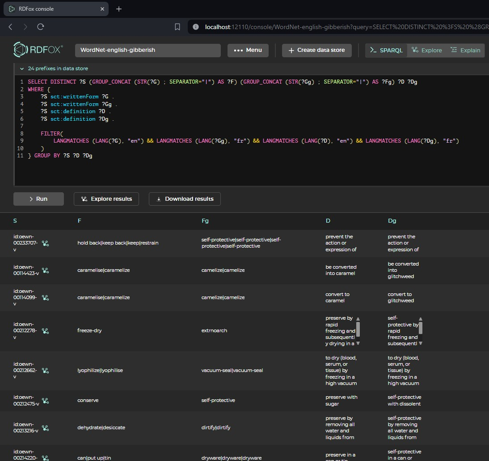
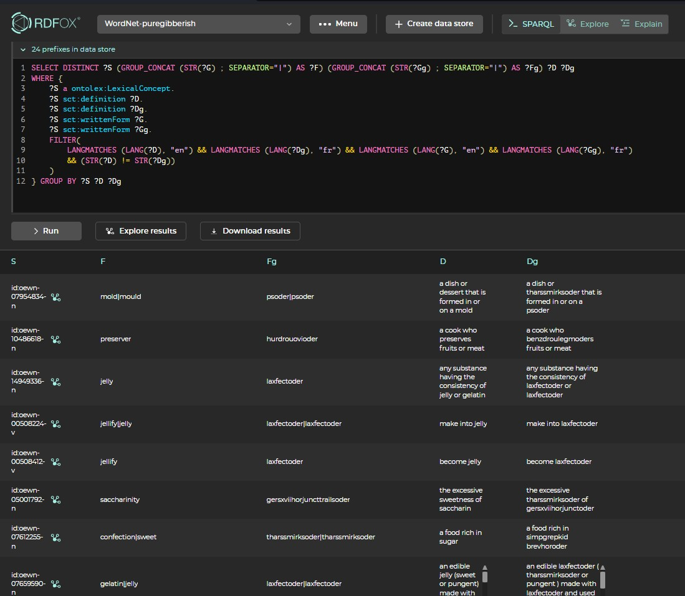

# wordnet-gibberish

Code of paper: Do LLMs Really Adapt to Domains? An Ontology Learning Perspective  (ISWC 2024)

## Description

The `wordnet-gibberish` project is a research project for creating gibberish words using WordNet, a lexical database for the English language. The project aims to create a parallel corpus of a subset of WordNet by turning words and definitions into gibberish.

See a preview of such gibberish forms and definitions:



## Installation

To use the `wordnet-gibberish` project, follow these steps:

1. Clone the repository to your local machine.
2. Install the dependencies using the `environment.yml` file:
```bash
conda env create -f environment.yml
conda activate wordnet_gibberish
```
3. Install the `gibberify` package from [this forked repo](https://github.com/htmai-880/gibberify):
```bash
pip install git+https://github.com/htmai-880/gibberify
```
4. Install the `wordnet_gibberish` package:
```bash
pip install -e .
```

To run the Jupyter notebooks in the `/notebooks/` directory, you should also install the following packages:
```bash
conda install jupyterlab # To run Jupyter notebooks
conda install conda-forge::python-dotenv # Environment variables
pip install -U langchain # Langchain 0.1.12
pip install langchain-openai # For using OpenAI GPT3.5
```

## Usage

Once the project is running, you can generate gibberish words by accessing the provided API endpoints. currently, the only supported query engine is RDFox.

The generated words can be used for various purposes, such as creating unique usernames, generating random passwords, or adding randomness to text. Currently, two settings of word generation (from the original word and definition) are handled:
- Using gibberify (see [this forked repo](https://github.com/htmai-880/gibberify))
- Using GPT2 (see [this forked repo](https://github.com/htmai-880/this-word-does-not-exist)). Note that this one is significantly slower.

See the notebook `/notebooks/getting_started.ipynb` for an example.

## Create a Dataset

Currently, three datasets are supported by the project, with hardcoded seed concepts:
- WN-sweets : A collection of concepts related to sweets, desserts, sweet food or sugar. In this dataset, hypernyms are frequent, and concepts are relatively well constructed from their hypernyms.
- WN-football : A collection of concepts related to football. This dataset, created by browsing co-topic concepts, includes less taxonomic relationships, but has its own terminology and jargon.
- WN-music : A collection of concepts related to musical instruments. It is the largest of the three.

The project assumes that a RDFox endpoint is running at `http://localhost:12110` and the RDFox server is started with the `WordNet-X` datastore (where `X` is either `sweets`, `football` or `music`), initialized with the Open English WordNet (which you can download from [here](https://github.com/globalwordnet/english-wordnet)).

To create a gibberish dataset (for instance, `sweets`), run the following command:
```bash
python main.py --which sweets --translator puregibberish
```

This will populate the Knowledge Graph with the gibberish forms of the domain concepts and their definitions. By default, the language tag is set to `en` for real lexical forms/definitions and to `fr` for their gibberish counterparts.

After that, to export the dataset, run:
```bash
python export.py --which sweets --save_dir ./path/to/save
```

Note that during the creation of the dataset, a file `data/fake/sweets_connected_concepts.csv` will be created alongside its parent directories. This file contains the connected concepts in the dataset, which can be used for evaluation purposes.

### Datasets for evaluation

Following the paper, we use the gibberish parallel corpora to perform relation extraction and taxonomy discovery. For reproductibility purposes, both datasets are created for you [here](https://figshare.com/s/7b9b51df1eb52fc9da42). But in case you are curious, you can also do it yourself.

Given that `data/fake/sweets_connected_concepts.csv` exists, create a dataset for relation extraction, run the following command:
```bash
python extract.py --which sweets
```
This will save a file `data/fake/sweets_extraction_dataset.csv` which contains the domain concepts and their gibberish counterpart.

## Purpose of this Software

The software is a research prototype, solely developed and published as supporting material for the research paper cited below. It will not be maintained or monitored in any way.

## License

This software is open-sourced under the AGPL-3.0 license. See the `LICENSE` file for details.

The Open English WordNet (2023 Edition) is released under the Creative Commons Attribution 4.0 International License. See their LICENSE file [here](https://github.com/globalwordnet/english-wordnet/blob/main/LICENSE.md) for details.

## Citation

If you use our software or datasets generated by it, please cite our [paper](https://arxiv.org/abs/2407.19998):

```
@misc{mai2024llmsreallyadaptdomains,
      title={Do LLMs Really Adapt to Domains? An Ontology Learning Perspective}, 
      author={Huu Tan Mai and Cuong Xuan Chu and Heiko Paulheim},
      year={2024},
      eprint={2407.19998},
      archivePrefix={arXiv},
      primaryClass={cs.CL},
      url={https://arxiv.org/abs/2407.19998}, 
}
```

## Contact

For any inquiries or questions, please contact the project maintainer at [huutan.mai@de.bosch.com](mailto:huutan.mai@de.bosch.com).
